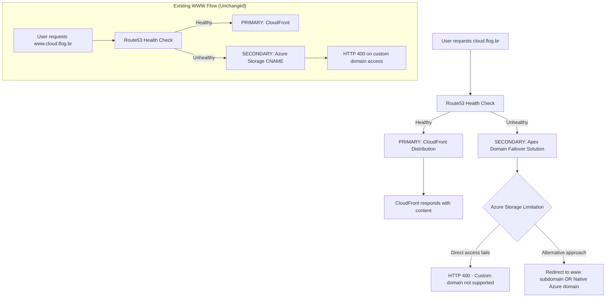
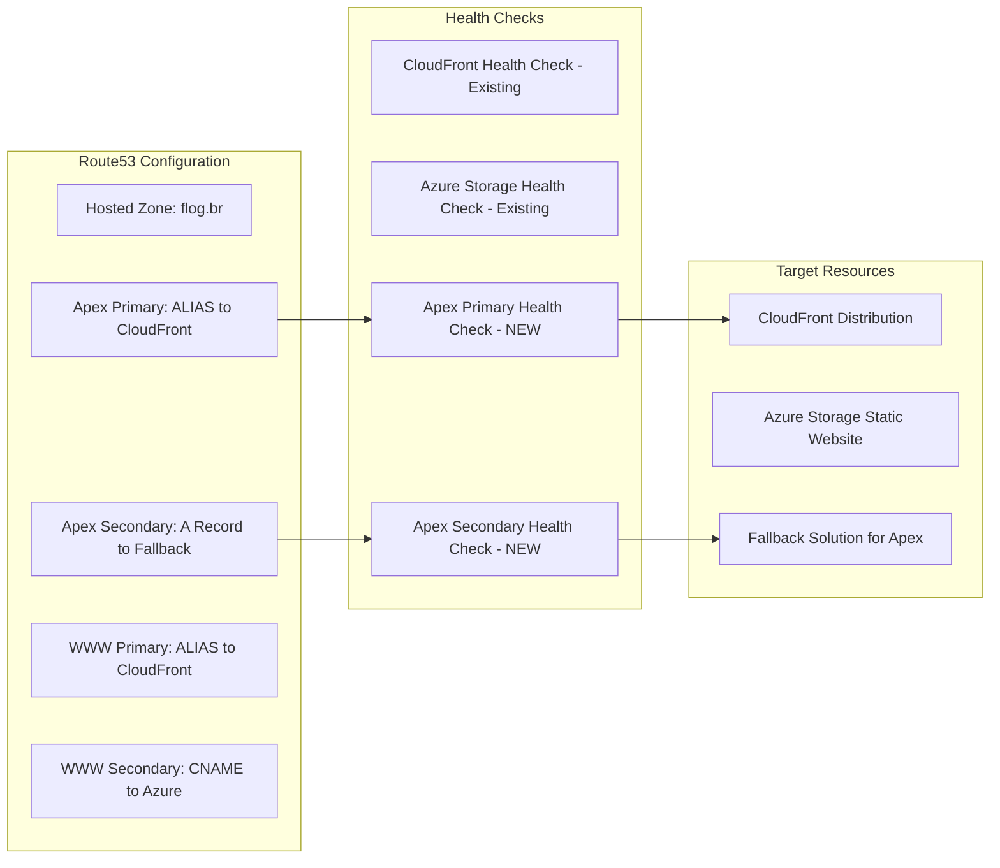

# Design Document: Apex Domain Failover

## Overview

Esta especificação técnica detalha a implementação de failover automático para o apex domain (cloud.flog.br) no sistema multicloud existente. A solução aborda as limitações técnicas fundamentais do DNS e do Azure Storage para fornecer failover funcional do domínio raiz.

### Current State
- **cloud.flog.br** → CloudFront Distribution (PRIMARY) - **SEM failover**
- **www.cloud.flog.br** → Azure Storage (SECONDARY) - COM failover, mas com limitações

### Target State  
- **cloud.flog.br** → CloudFront Distribution (PRIMARY) com failover para solução técnica viável
- **www.cloud.flog.br** → Mantém configuração atual (sem alterações)

### Core Challenge
O desafio principal é que apex domains não podem usar registros CNAME (limitação RFC DNS), mas Azure Storage Static Websites requerem CNAME para domínios customizados, criando um impasse técnico.

## Architecture

### DNS Resolution Flow



### Technical Architecture Components



## Components and Interfaces

### 1. Route53 DNS Records

**New Apex Domain Records:**
- **Primary Record**: ALIAS record pointing to CloudFront (similar to current www setup)
- **Secondary Record**: Implementation depends on chosen fallback approach (see options below)

**Health Check Configuration:**
- **Primary Health Check**: HTTPS check against CloudFront domain
- **Secondary Health Check**: HTTPS check against fallback solution

### 2. Failover Strategy Options

Due to technical limitations, we have three viable approaches for apex domain secondary failover:

#### Option A: HTTP Redirect Approach (Recommended)
- **Secondary Target**: Simple HTTP redirect service (AWS Lambda@Edge or S3 redirect)
- **Behavior**: Redirects users from cloud.flog.br → www.cloud.flog.br during failover
- **Pros**: Clean user experience, leverages existing www failover
- **Cons**: Additional redirect hop

#### Option B: Native Azure Domain Approach  
- **Secondary Target**: A record pointing to Azure Storage IP (if static)
- **Behavior**: Routes to myaccounttostorageweb.z13.web.core.windows.net
- **Pros**: Direct access to content
- **Cons**: Users see Azure native domain in browser, HTTP 400 errors on custom domain headers

#### Option C: CloudFlare Proxy Approach
- **Secondary Target**: CloudFlare proxy that forwards to Azure native domain
- **Behavior**: Maintains custom domain while proxying to Azure
- **Pros**: Clean domain experience  
- **Cons**: Additional external dependency

### 3. Implementation Components

**Terraform Resources (New):**
```hcl
# Apex domain primary record
resource "aws_route53_record" "apex_primary"

# Apex domain secondary record (approach-dependent)
resource "aws_route53_record" "apex_secondary"

# Health checks for apex domain
resource "aws_route53_health_check" "apex_primary"
resource "aws_route53_health_check" "apex_secondary"

# Fallback service (if using redirect approach)
resource "aws_lambda_function" "apex_redirect" # Optional
```

## Data Models

### Route53 Record Configuration

```terraform
# Primary Apex Record
{
  zone_id = aws_route53_zone.this.zone_id
  name    = var.dns_config.domain_name  # "cloud.flog.br"
  type    = "A"
  
  alias {
    name                   = var.dns_config.cloudfront_domain
    zone_id                = var.dns_config.cloudfront_zone_id  
    evaluate_target_health = true
  }
  
  failover_routing_policy {
    type = "PRIMARY"
  }
  
  set_identifier  = "apex-primary"
  health_check_id = aws_route53_health_check.apex_primary.id
}

# Secondary Apex Record (Redirect Approach)
{
  zone_id = aws_route53_zone.this.zone_id
  name    = var.dns_config.domain_name
  type    = "A"
  
  alias {
    name                   = aws_s3_bucket_website.redirect.website_domain
    zone_id                = aws_s3_bucket_website.redirect.hosted_zone_id
    evaluate_target_health = false
  }
  
  failover_routing_policy {
    type = "SECONDARY"
  }
  
  set_identifier  = "apex-secondary"
}
```

### Health Check Configuration

```terraform
# Apex Primary Health Check
{
  type              = "HTTPS"
  fqdn              = var.dns_config.cloudfront_domain
  port              = 443
  request_interval  = 30
  failure_threshold = 3
  resource_path     = "/"
}

# Apex Secondary Health Check (for redirect solution)
{
  type              = "HTTPS" 
  fqdn              = aws_s3_bucket_website.redirect.website_endpoint
  port              = 443
  request_interval  = 30
  failure_threshold = 3
  resource_path     = "/"
}
```

### Variable Extensions

```terraform
variable "dns_config" {
  description = "Extended DNS configuration with apex failover options"
  type = object({
    domain_name        = string
    cloudfront_domain  = string
    cloudfront_zone_id = string
    
    apex_failover = object({
      enabled  = bool
      approach = string  # "redirect", "native", "cloudflare"
      redirect_target = optional(string, "www")  # for redirect approach
    })
    
    health_checks = object({
      request_interval  = optional(number, 30)
      failure_threshold = optional(number, 3)
    })
  })
}
```

## Correctness Properties

*A property is a characteristic or behavior that should hold true across all valid executions of a system—essentially, a formal statement about what the system should do. Properties serve as the bridge between human-readable specifications and machine-verifiable correctness guarantees.*

Based on the prework analysis, the following properties have been identified for testing:

### Property Reflection

After reviewing the prework analysis, several properties can be consolidated:
- Properties 2.3, 2.4, 3.4, and 5.3 all relate to configuration consistency and can be combined
- Properties 2.5, 6.1, 6.3, and 6.4 all relate to preservation of existing functionality and can be combined
- Properties 1.2 and 6.5 both relate to round trip behavior and can be combined

### Core Properties

**Property 1: Apex Domain Failover Behavior**
*For any* CloudFront failure scenario, when health checks detect the primary endpoint as unhealthy, DNS resolution for cloud.flog.br should redirect to the configured secondary failover solution
**Validates: Requirements 1.1**

**Property 2: Failover Recovery Round Trip**  
*For any* apex domain configuration, when primary fails then recovers, the system should return to the original primary routing state
**Validates: Requirements 1.2, 6.5**

**Property 3: Failover Timing Consistency**
*For any* health check configuration, apex domain health checks should use identical timing parameters (interval, failure threshold) as www domain health checks
**Validates: Requirements 1.4, 2.4, 3.4**

**Property 4: System Isolation and Independence**
*For any* apex domain failover event, the existing www domain failover functionality should remain completely unaffected and operate independently
**Validates: Requirements 1.5**

**Property 5: Configuration Preservation**
*For any* terraform deployment of apex domain resources, all existing Route53 records, health checks, CloudFront distributions, and Azure Storage configurations should remain unchanged
**Validates: Requirements 2.5, 6.1, 6.3, 6.4**

**Property 6: Independent Failover Operation**
*For any* primary endpoint failure, apex domain failover should trigger independently of www domain health status
**Validates: Requirements 3.2**

**Property 7: Health Check Resource Consistency**
*For any* health check created for apex domain, it should follow the same configuration patterns (tagging, parameters, monitoring) as existing health checks
**Validates: Requirements 3.5, 5.3**

**Property 8: Fallback Access Reliability**
*For any* secondary failover activation, alternative access methods should provide working application access during failover periods
**Validates: Requirements 4.2, 4.3**

**Property 9: Clean Resource Management** 
*For any* apex domain configuration removal, only apex-specific resources should be deleted while preserving all other system resources
**Validates: Requirements 6.2**

## Error Handling

### DNS Resolution Failures

**Primary CloudFront Unavailable:**
- Health checks detect failure within 90 seconds (3 failures × 30s interval)
- Route53 automatically redirects apex domain to secondary failover solution
- Users experience redirect or alternative access method based on chosen approach
- Recovery happens automatically when health checks pass again

**Secondary Failover Unavailable:**
- If redirect approach fails, users get standard browser errors
- If native Azure approach fails, users may see HTTP 400 errors on custom domain access
- System maintains logs of failover attempts for troubleshooting
- Manual intervention may be required for complex failure scenarios

**DNS Propagation Issues:**
- TTL values are consistent (60s) to ensure predictable failover timing
- Health check intervals (30s) are shorter than TTL for faster detection
- Geographic DNS caching may cause varying user experiences during failover

### Azure Storage Limitations

**Custom Domain HTTP 400 Errors:**
- Expected behavior when Azure Storage receives requests with custom domain headers
- System documents this limitation clearly in deployment outputs
- Alternative access methods (native domain or redirect) provided as fallback

**Azure Storage Service Outages:**
- Health checks detect Azure unavailability
- During dual-cloud outage, manual intervention required
- System provides clear error messages and troubleshooting guidance

### Terraform State Conflicts

**Resource Naming Conflicts:**
- All apex domain resources use "apex_" prefix to avoid conflicts
- Existing www domain resources remain unchanged
- State file isolation prevents cross-contamination

**Deployment Failures:**
- Terraform plan validation catches configuration errors before apply
- Rollback procedures documented for failed deployments
- State file backup recommended before major changes

## Testing Strategy

### Dual Testing Approach

The testing strategy employs both unit tests and property-based tests for comprehensive validation:

**Unit Tests:**
- Verify specific examples and edge cases
- Test integration points between Route53, health checks, and target resources
- Validate Terraform resource creation and configuration
- Test error conditions and failure scenarios

**Property-Based Tests:**
- Verify universal properties across all input variations
- Test failover behavior with randomized failure scenarios
- Validate configuration consistency across multiple deployments
- Ensure system behavior holds across all valid parameter combinations

### Property-Based Testing Configuration

**Framework:** Using Terraform's testing framework with Go-based property tests
**Minimum Iterations:** 100 per property test to ensure comprehensive coverage
**Test Environment:** Isolated AWS/Azure accounts for safe testing

Each property-based test includes:
- **Tag Format:** Feature: apex-domain-failover, Property {number}: {property_text}
- **Requirements Traceability:** Each test references its corresponding design property
- **Randomized Inputs:** DNS configurations, failure scenarios, timing parameters

### Test Implementation Strategy

**Infrastructure Tests:**
- Terraform configuration validation
- Resource creation and dependency verification
- Health check configuration correctness

**Functional Tests:**
- DNS resolution behavior during normal operation
- Failover trigger and recovery scenarios
- Cross-domain independence verification

**Integration Tests:**
- End-to-end failover testing with real health check failures
- Azure Storage limitation handling
- Multi-cloud scenario validation

### Unit Test Balance

Unit tests focus on:
- Specific examples that demonstrate correct DNS configuration
- Edge cases like simultaneous failures or rapid recovery scenarios
- Error conditions such as invalid configurations or missing resources
- Integration points between Terraform modules

Property tests handle comprehensive input coverage through randomization, while unit tests catch concrete bugs and validate specific integration points. Together, they provide complete confidence in system correctness.