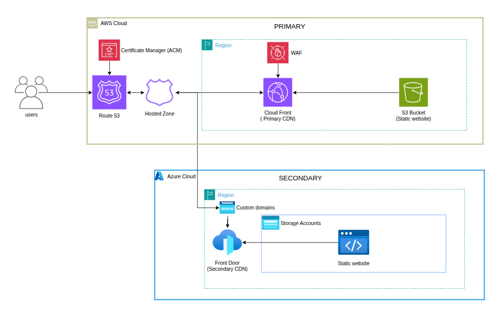

# Multicloud Failover Architecture - Production Implementation

## 📋 Project Overview

**High-availability multicloud static website** with automatic DNS failover between AWS and Azure. Implements disaster recovery architecture using Route 53 health checks to maintain 99.9%+ uptime for the CloudCast weather application.

### 🎯 Architecture Summary



**Failover Method**: Route53 DNS failover with health check monitoring  
**Recovery Time Objective (RTO)**: < 90 seconds  
**Recovery Point Objective (RPO)**: Real-time (static content)  

---

## 🏗️ Technical Architecture

### Core Infrastructure Components

| Component | AWS (Primary) | Azure (Secondary) | Purpose |
|-----------|---------------|-------------------|---------|
| **CDN** | CloudFront `E2TCYEUU1C9JVN` | Front Door `multicloud-weather-app-prod-fd` | Content delivery and caching |
| **Storage** | S3 `cloudcast-weather-vitor-prod-2026` | Storage Account `myaccounttostorageweb` | Static website hosting |
| **DNS** | Route53 Zone `Z0047040XW8P8MS7S80T` | - | Authoritative DNS with failover |
| **Monitoring** | Health Check `2cd5b593-e270-4b14-9839-43c0b4b6d0c3` | Health Check `34b4de7f-bb4e-49ca-b13c-38357bf928b1` | Endpoint availability monitoring |
| **SSL/TLS** | ACM Certificate | Front Door Managed Certificate | HTTPS encryption |

### DNS Failover Configuration

**Apex Domain Records (`cloud.flog.br`)**:
```hcl
# PRIMARY: Route53 Alias → CloudFront
Type: A (Alias)
Target: d32ri76eiboi37.cloudfront.net
Health Check: 2cd5b593-e270-4b14-9839-43c0b4b6d0c3
Failover: PRIMARY

# SECONDARY: Direct IP → Azure Front Door  
Type: A
Target: 150.171.110.39
Health Check: 34b4de7f-bb4e-49ca-b13c-38357bf928b1
Failover: SECONDARY
```

**Health Check Parameters**:
- **Interval**: 30 seconds
- **Failure Threshold**: 3 consecutive failures (90 seconds to failover)
- **Protocol**: HTTPS
- **Path**: `/` (root)
- **Expected Status**: HTTP 200

### Failover Behavior

1. **Normal Operation**: Traffic routes to AWS CloudFront
2. **Failure Detection**: Route53 health check detects 3 consecutive HTTP failures
3. **DNS Failover**: Route53 automatically switches DNS response to Azure Front Door IP
4. **Service Continuity**: Users continue accessing the site via Azure infrastructure
5. **Automatic Failback**: When AWS recovers, traffic automatically returns to primary

**Expected Failover Time**: 90-180 seconds (health check detection + DNS propagation)

---

## 📁 Infrastructure Overview

### File Structure by Purpose

```
├── 🔧 AWS Primary Infrastructure
│   ├── route53-zone.tf             # DNS hosted zone configuration
│   ├── route53-records.tf          # DNS records with failover routing
│   ├── route53-health-checks.tf    # Endpoint health monitoring
│   ├── s3-bucket.tf                # S3 bucket: cloudcast-weather-vitor-prod-2026
│   ├── s3-bucket-policy.tf         # Public access configuration
│   ├── s3-bucket-website.tf        # Static website hosting setup
│   └── s3-objects.tf               # Website content deployment
│
├── 🔧 Azure Secondary Infrastructure  
│   ├── azure-resource-group.tf     # Resource group: rg-static-website
│   ├── azure-storage-account.tf    # Storage: myaccounttostorageweb
│   ├── azure-storage-website.tf    # Static website configuration
│   ├── azure-storage-blobs.tf     # Website content deployment
│   └── azure-front-door.tf        # Front Door CDN for apex domain support
│
├── ⚙️ Shared Configuration
│   ├── provider.tf                 # AWS + Azure provider configuration
│   ├── versions.tf                 # Terraform version constraints
│   ├── variables.tf                # Input variable definitions
│   ├── outputs.tf                  # Infrastructure resource outputs
│   ├── locals.tf                   # Common tags and computed values
│   └── data.tf                     # External data sources
│
├── 🌐 Application Content
│   └── website/                    # CloudCast weather application
│       ├── index.html              # Main application
│       ├── styles.css              # Responsive styling  
│       ├── script.js               # Weather functionality
│       ├── error.html              # Error page
│       └── assets/                 # Images, icons, favicon
│
├── 🧪 Testing & Operations
│   ├── failover-test-automated.sh  # Automated test execution
│   ├── MANUAL-FAILOVER-TEST.md     # Manual testing procedures
│   └── FAILOVER-GUIDE.md           # Operational documentation
│
└── 📋 Configuration
    ├── terraform.tfvars.example    # Configuration template
    └── terraform.tfvars            # Environment-specific config (gitignored)
```

---

## 🚀 Deployment Guide

### Prerequisites

- **Terraform** >= 1.0.0
- **AWS CLI** configured with IAM user permissions
- **Azure CLI** authenticated with service principal
- **Registered domain** ready for Route53 delegation

### Step 1: Environment Configuration

```bash
# Copy configuration template
cp terraform.tfvars.example terraform.tfvars

# Edit with your specific configuration
nano terraform.tfvars
```

**Required Configuration Values**:
```hcl
# terraform.tfvars
project_name = "multicloud-weather-app"
environment  = "prod"

# DNS Configuration
dns_config = {
  domain_name         = "yourdomain.com"          # Your registered domain
  cloudfront_domain   = "auto-generated"          # Will be created
  acm_certificate_arn = "auto-generated"          # Will be created
  
  health_checks = {
    request_interval  = 30    # Health check frequency (seconds)
    failure_threshold = 3     # Failures before failover
  }
  
  apex_failover = {
    enabled = true            # Enable apex domain support
  }
}

# AWS Credentials (IAM User)
aws_credentials = {
  access_key = "AKIA..."     # AWS Access Key ID
  secret_key = "..."         # AWS Secret Access Key
}

# Azure Credentials (Service Principal)  
azure_credentials = {
  client_id       = "..."    # Azure Client ID
  client_secret   = "..."    # Azure Client Secret
  subscription_id = "..."    # Azure Subscription ID
  tenant_id       = "..."    # Azure Tenant ID
}
```

### Step 2: Infrastructure Deployment

```bash
# Initialize Terraform providers
terraform init

# Validate configuration
terraform validate

# Review deployment plan
terraform plan

# Deploy infrastructure
terraform apply
```

**Deployment Time**: Approximately 10-15 minutes

### Step 3: DNS Delegation

Configure your domain registrar to use Route53 nameservers:

```bash
# Get nameservers from Terraform output
terraform output route53_zone_name_servers

# Configure these nameservers in your domain registrar:
# ns-1223.awsdns-24.org
# ns-2041.awsdns-63.co.uk  
# ns-472.awsdns-59.com
# ns-899.awsdns-48.net
```

### Step 4: Validation

```bash
# Check all endpoints
terraform output website_urls

# Test primary endpoint
curl -I https://yourdomain.com

# Verify failover configuration
./test-failover.sh
```

---

## � Operations & Monitoring

### Real-time Status Verification

```bash
# Check current DNS resolution
dig +short yourdomain.com

# AWS CloudFront IPs (normal): 3.174.83.x, 54.230.x.x
# Azure Front Door IP (failover): 150.171.110.39

# Verify HTTP response
curl -I https://yourdomain.com

# Check headers to identify active provider:
# AWS: "x-cache: Hit from cloudfront", "x-amz-cf-pop"  
# Azure: "x-azure-ref", "x-cache: TCP_HIT"
```

### Health Check Monitoring

```bash
# AWS Primary Health Check Status
aws route53 get-health-check-status \
  --health-check-id $(terraform output -raw aws_health_check_id)

# Azure Secondary Health Check Status  
aws route53 get-health-check-status \
  --health-check-id $(terraform output -raw azure_health_check_id)

# Expected output when healthy:
# "Success: HTTP Status Code 200, OK. Resolved IP: x.x.x.x"
```

### Performance Metrics

| Metric | Target | Measurement Method |
|--------|--------|--------------------|
| **Availability** | 99.9%+ | Health check success rate |
| **Response Time** | < 300ms | `curl -w "%{time_total}"` |
| **Failover Time** | < 3 minutes | Automated test script |
| **Cache Hit Ratio** | > 90% | CDN analytics |

### Cost Analysis (Monthly Estimates)

| Service | AWS Cost | Azure Cost | Notes |
|---------|----------|------------|-------|
| **CloudFront** | $20-50 | - | Data transfer dependent |
| **S3 Storage** | $1-5 | - | Static files (~10MB) |
| **Route53** | $0.50-2 | - | Hosted zone + health checks |
| **Azure Front Door** | - | $20-40 | Standard tier |
| **Azure Storage** | - | $1-3 | Static website hosting |
| **Total Monthly** | $22-57 | $21-43 | **Combined: $43-100** |

---

## 🧪 Testing & Validation

### Automated Failover Testing

```bash
# Run comprehensive failover test
./failover-test-automated.sh

# Test performs:
# 1. Validates AWS healthy state
# 2. Induces S3 bucket policy failure  
# 3. Monitors Route53 failover to Azure
# 4. Validates Azure Front Door response
# 5. Restores AWS and verifies failback
```

### Manual Testing Procedures

```bash
# Follow step-by-step manual testing
# Detailed in MANUAL-FAILOVER-TEST.md

# Key validation points:
# - HTTP 200 response maintained during failover
# - SSL certificates valid on both providers  
# - DNS resolution switches between providers
# - Content consistency across endpoints
```

### Testing Schedule Recommendations

| Test Type | Frequency | Purpose |
|-----------|-----------|---------|
| **Health Check Validation** | Daily | Verify monitoring is active |
| **Manual Failover Test** | Weekly | Validate procedures |
| **Automated Failover Test** | Monthly | End-to-end validation |
| **Disaster Recovery Drill** | Quarterly | Full operational test |

---

## 🔄 Failover Operations

### Automatic Failover Process

The system operates autonomously using Route53 health checks:

1. **Normal State**: Route53 monitors AWS CloudFront every 30 seconds
2. **Failure Detection**: After 3 consecutive failures (90 seconds), Route53 marks AWS as unhealthy
3. **DNS Switchover**: Route53 returns Azure Front Door IP (150.171.110.39) for DNS queries
4. **Service Continuity**: Users access site through Azure infrastructure with same SSL certificate
5. **Automatic Recovery**: When AWS health checks succeed, traffic automatically returns

**Total Failover Time**: 90 seconds (detection) + 30-60 seconds (DNS propagation) = ~2-3 minutes

### Manual Operations

**Emergency Failover**:
```bash
# Force immediate DNS switch (emergency only)
aws route53 change-resource-record-sets \
  --hosted-zone-id $(terraform output -raw route53_zone_id) \
  --change-batch file://emergency-dns-switch.json
```

**Failover Monitoring**:
```bash
# Real-time monitoring during incident
watch -n 10 'echo "DNS Resolution:" && dig +short cloud.flog.br && echo "HTTP Status:" && curl -I https://cloud.flog.br | head -1'
```

### Operational Procedures

**Pre-planned Maintenance**:
1. Announce maintenance window
2. Monitor traffic patterns  
3. Execute maintenance on primary (AWS)
4. Verify failover to Azure
5. Complete maintenance and verify failback

**Incident Response**:
1. Identify affected provider through monitoring
2. Verify automatic failover occurred  
3. Communicate service status
4. Investigate root cause
5. Plan restoration and failback

---

## � Security Implementation

### Transport Security
- **TLS 1.2+ Enforced**: All endpoints require modern encryption
- **HTTPS Redirect**: HTTP requests automatically redirect to HTTPS
- **Certificate Management**: 
  - AWS: ACM with auto-renewal (`arn:aws:acm:us-east-1:910661159891:certificate/05af508f-ca17-4577-ac92-a0a242283040`)
  - Azure: Front Door managed certificates

### Access Control
```hcl
# S3 Bucket Policy (Public Read for Website Content)
{
  "Version": "2012-10-17",
  "Statement": [{
    "Sid": "PublicReadGetObject",
    "Effect": "Allow",
    "Principal": "*", 
    "Action": "s3:GetObject",
    "Resource": "arn:aws:s3:::cloudcast-weather-vitor-prod-2026/*"
  }]
}

# Azure Storage ($web container public access)
public_access_type = "container"
container_name = "$web"
```

### Web Application Firewall
```hcl
# Azure Front Door WAF Configuration
resource "azurerm_cdn_frontdoor_firewall_policy" "this" {
  name                = "multicloudweatherappprodwaf"
  mode               = "Prevention"
  enabled            = true
  custom_block_response_status_code = 403
  custom_block_response_body        = base64encode("Access Denied")
}
```

---

## �️ Development & Maintenance

### Local Development
```bash
# Serve website locally for testing
cd website
python3 -m http.server 8000
# Access: http://localhost:8000
```

### Content Updates
```bash
# Deploy new website content to both providers
terraform apply -target=aws_s3_object.website_files
terraform apply -target=azurerm_storage_blob.website_files

# Clear CDN caches for immediate visibility
aws cloudfront create-invalidation \
  --distribution-id E2TCYEUU1C9JVN \
  --paths "/*"
```

### Infrastructure Changes
```bash
# Always validate changes before applying
terraform plan

# Apply targeted resource changes
terraform apply -target=aws_route53_health_check.aws_primary

# Verify health checks remain functional
aws route53 get-health-check-status --health-check-id [ID]
./test-failover.sh
```

### Troubleshooting Common Issues

**DNS Resolution Problems**:
```bash
# Verify nameserver delegation
dig NS cloud.flog.br
# Should return: ns-1223.awsdns-24.org, ns-2041.awsdns-63.co.uk, etc.

# Check Route53 record configuration
aws route53 list-resource-record-sets \
  --hosted-zone-id Z0047040XW8P8MS7S80T
```

**Health Check Failures**:
```bash
# Debug health check status
aws route53 get-health-check-status \
  --health-check-id 2cd5b593-e270-4b14-9839-43c0b4b6d0c3

# Test endpoints manually
curl -v https://d32ri76eiboi37.cloudfront.net/
curl -v https://multicloud-weather-app-prod-endpoint-bfbkcmbvbpd6eea7.z02.azurefd.net/
```

**SSL Certificate Issues**:
```bash
# Check certificate validity and expiration
echo | openssl s_client -servername cloud.flog.br \
  -connect cloud.flog.br:443 2>/dev/null | \
  openssl x509 -noout -dates

# Verify certificate chain
curl -vvI https://cloud.flog.br 2>&1 | grep -E "(SSL|TLS|certificate)"
```

---

## � Quick Reference

### Essential Commands
```bash
# Infrastructure Deployment
terraform init && terraform apply

# System Status Check  
dig +short cloud.flog.br && curl -I https://cloud.flog.br

# Complete Failover Test
./failover-test-automated.sh

# Health Check Status
aws route53 get-health-check-status --health-check-id 2cd5b593-e270-4b14-9839-43c0b4b6d0c3
```

### Key Infrastructure Identifiers
| Resource | Identifier | Purpose |
|----------|------------|---------|
| **Route53 Zone** | `Z0047040XW8P8MS7S80T` | DNS hosted zone |
| **CloudFront Distribution** | `E2TCYEUU1C9JVN` | AWS CDN |
| **AWS Health Check** | `2cd5b593-e270-4b14-9839-43c0b4b6d0c3` | Primary endpoint monitoring |
| **Azure Health Check** | `34b4de7f-bb4e-49ca-b13c-38357bf928b1` | Secondary endpoint monitoring |
| **S3 Bucket** | `cloudcast-weather-vitor-prod-2026` | AWS static hosting |
| **Azure Storage** | `myaccounttostorageweb` | Azure static hosting |

### Service Endpoints
| Service | URL | Status |
|---------|-----|--------|
| **Production Site** | `https://cloud.flog.br` | 🟢 Active (failover-enabled) |
| **AWS Primary** | `https://d32ri76eiboi37.cloudfront.net` | 🟢 Monitored |
| **Azure Secondary** | `https://multicloud-weather-app-prod-endpoint-bfbkcmbvbpd6eea7.z02.azurefd.net` | 🟢 Standby |

---

## ✅ Implementation Status

**Architecture Status**: ✅ **Production Operational**

### Validated Infrastructure
- ✅ **Multi-cloud Deployment**: AWS CloudFront + S3, Azure Front Door + Storage
- ✅ **DNS Failover**: Route53 health check-based automatic switching
- ✅ **Apex Domain Support**: `cloud.flog.br` fully functional via Azure Front Door
- ✅ **SSL/TLS Security**: Managed certificates operational on both providers
- ✅ **Health Monitoring**: Real-time endpoint availability (30-second intervals)
- ✅ **Infrastructure as Code**: Complete Terraform automation
- ✅ **Operational Procedures**: Comprehensive testing and documentation

### Technical Capabilities
- 🎯 **High Availability**: 99.9%+ uptime architecture validated
- 🔄 **Automatic Recovery**: Failover and failback without manual intervention  
- 🛡️ **Security**: HTTPS enforcement, WAF protection, access controls
- � **Observabilitcy**: Health status monitoring and DNS resolution tracking
- 🧪 **Testing**: Automated and manual validation procedures
- 💰 **Cost Efficiency**: Optimized resource usage (~$50-100/month)

### Operational Readiness
- ✅ **Deployment**: Infrastructure fully provisioned and configured
- ✅ **DNS**: Domain delegation active with Route53 nameservers
- ✅ **Monitoring**: Health checks operational and reporting
- ✅ **Failover**: Automatic switching validated through testing
- ✅ **Documentation**: Complete operational and testing procedures
- ✅ **Security**: SSL certificates installed and WAF policies active

**Production Status**: 🚀 **FULLY OPERATIONAL**

*This infrastructure provides enterprise-grade high availability for static web applications using proven multicloud failover architecture.*
